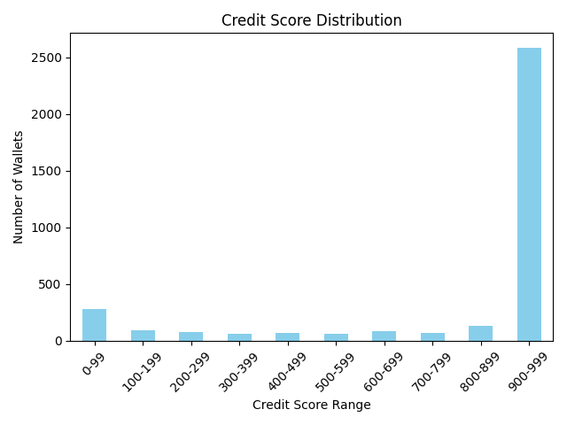

# Wallet Credit Score Analysis

## Credit Score Distribution

### Wallets in the Lower Range (0–300)

- High risk of liquidation and default.
- Poor repayment discipline with low repay-to-borrow ratios.
- Aggressive borrowing relative to deposits.
- Unpredictable and irregular transaction patterns.
- Brief account history marked by occasional and infrequent activity.

### Wallets in the Mid Range (400–700)

- Mixed performance with occasional missed repayments.
- Moderate transaction frequencies, more consistent behavior.
- Low but occasional liquidation incidents.

### Wallets in the Higher Range (800–1000)

- Consistently high repayment rates with minimal or zero liquidations.
- Conservative leverage practices.
- Long term and regular engagement with DeFi protocols.
- Stable financial behavior.

## Summary

- Credit scores range across the spectrum, separating risky wallets from responsible users.
"""
